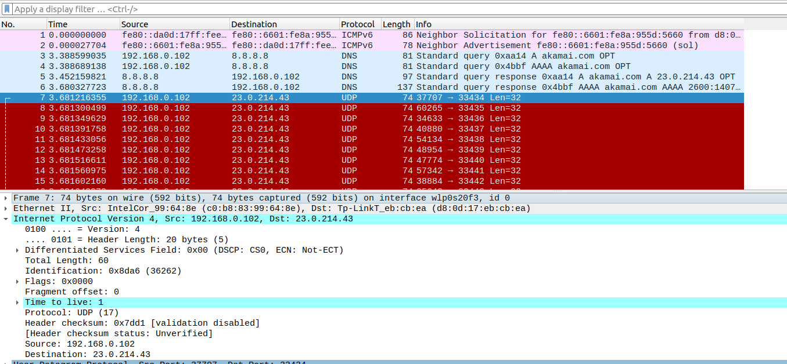
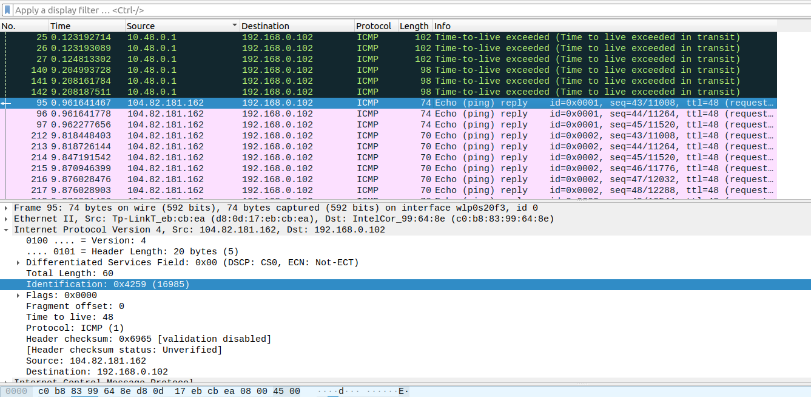
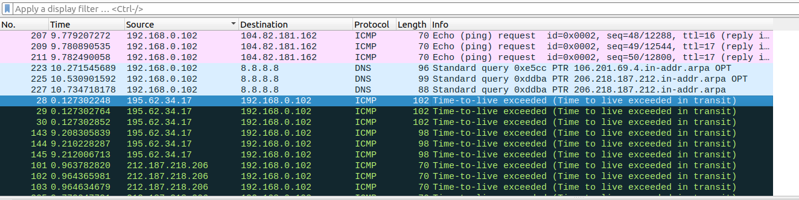
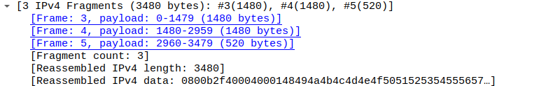
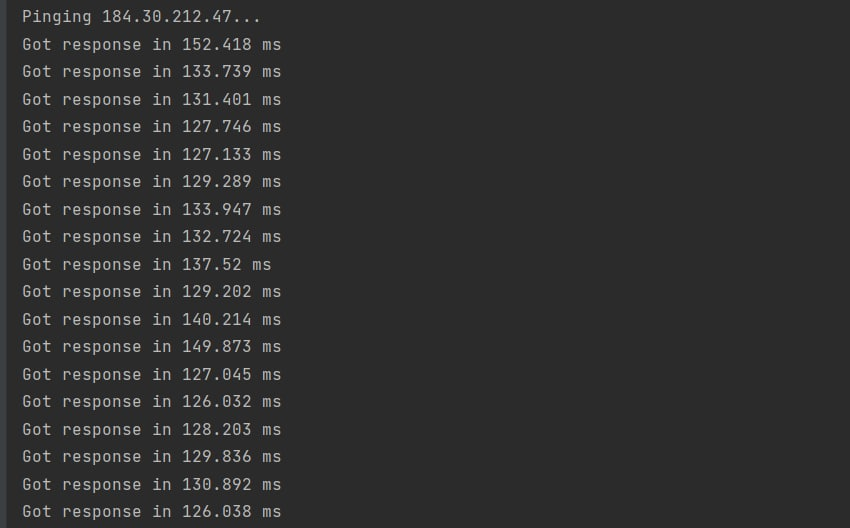
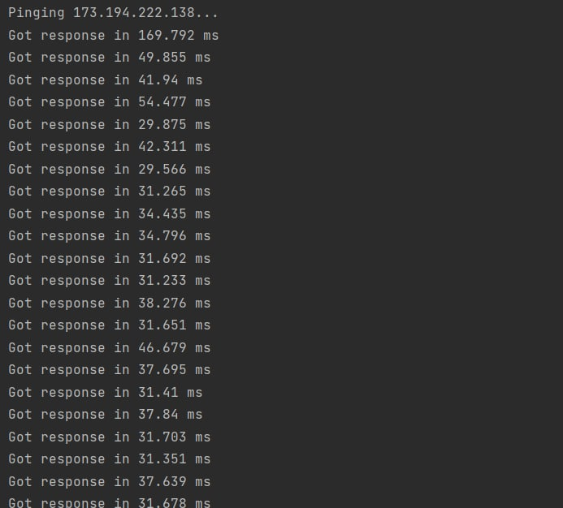

## Wireshark

1. 192.168.0.102

    
2. Protocol: UDP (17)
3. В заголовке 20 байт, вся длина 60 байт, полезная нагрузка 40 байт.
4.
    a) Identification, Header checksum и TTL

    b) Не меняются поля с длиной хедера, флаги, оффсет фрагментов, Source и Destionation, поле протокола, Differentiated Services Field.
    Должны меняться поля TTL, длина, Identification, Header checksum, Source

    с) С каждым следующим запросом увеличивается на 1

    

5. Identification: 0x4259 (16985), TTL: 48
6. Identification меняется, TTL нет
7. Identification: 0xa89d (43165), TTL: 62

    

8.
    a) Да, три фрагмента

    b) Fragment offset, Flags, Total length, Header checksum
    
    

---
## Ping
Команда `python3 ping.py mit.edu`

Команда `python3 ping.py google.com`

