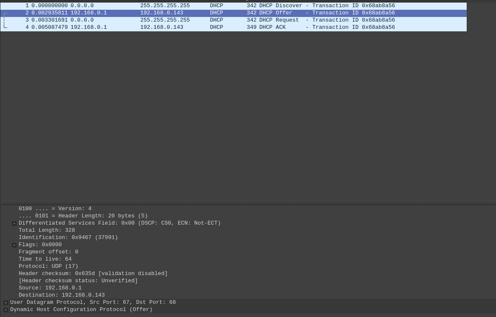
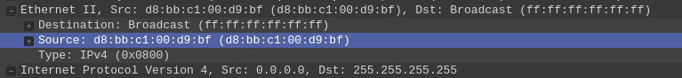

### Wireshark
1. Поверх UDP

    

2. d8:bb:c1:00:d9:bf

    

3. Значение 0x68ab8a56. Это поле позволяет клиенту понять, какому DHCP-запросу какой соответствует ответ.

4. Передается broadcast 255.255.255.255, Source IP будет IP клиента либо сервера, Destination IP будет 255.255.255.255

5. 192.168.0.1

6. Айпишник даётся DHCP сервером на какое-то время и потом этот айпишник освобождается, если клиент не продлевает срок.

    У меня он выдаётся на 2 часа

    

### Гифка со сканером (сильно ускоренная)

