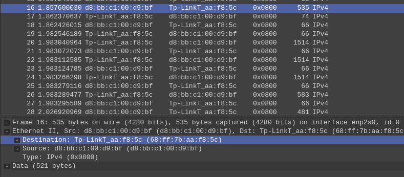
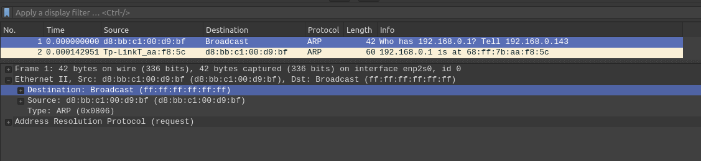
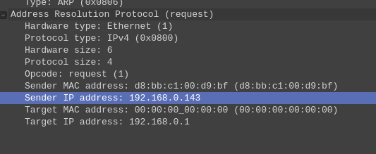
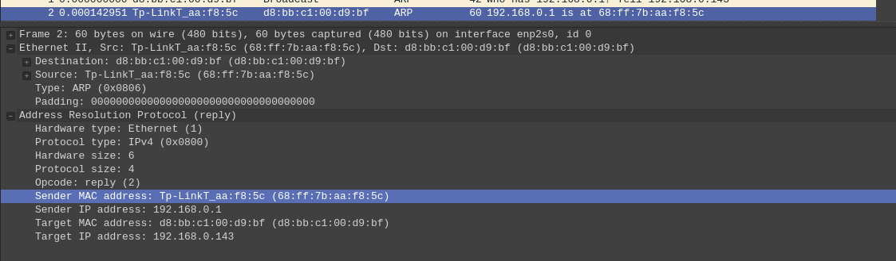

## Wireshark
1. Source: d8:bb:c1:00:d9:bf
    
2. Оно соответствует адресу моего сетевого адаптера
3. Source: Tp-LinkT_aa:f8:5c (68:ff:7b:aa:f8:5c). Оно соответствует роутеру сервера
4. Destination: d8:bb:c1:00:d9:bf (d8:bb:c1:00:d9:bf), это адрес моего компьютера

## ARP
1. Source: d8:bb:c1:00:d9:bf, Destination: Broadcast (ff:ff:ff:ff:ff:ff)
    
2. Да, в поле Sender (192.168.0.143)
    
3. Есть поле Target MAC, которое равно 00:00:00:00:00:00, потому что нам неизвестен
Ethernet адрес машины, чей IP мы запросили
4. В поле Sender MAC address: Tp-LinkT_aa:f8:5c (68:ff:7b:aa:f8:5c)
    