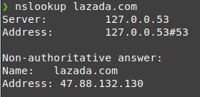
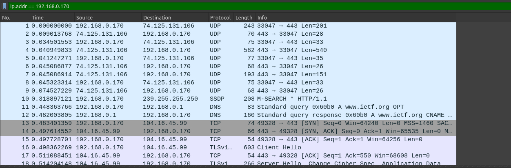
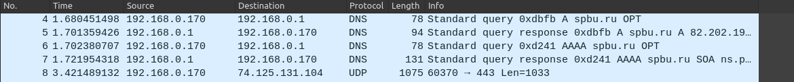
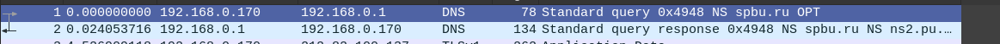
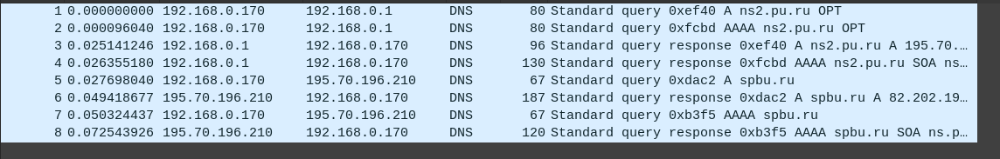
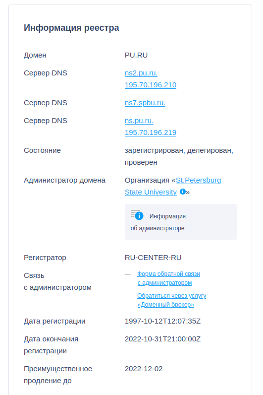
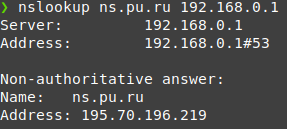
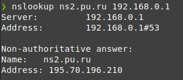

### Задание А
*
    ```
    nslookup lazada.com
    Name: lazada.com
    Address: 47.88.132.130
    ```

*
    ```
    nslookup -type=NS ox.ac.uk
    Server:		127.0.0.53
    Address:	127.0.0.53#53

    Non-authoritative answer:
    ox.ac.uk	nameserver = ns2.ja.net.
    ox.ac.uk	nameserver = dns0.ox.ac.uk.
    ox.ac.uk	nameserver = dns1.ox.ac.uk.
    ox.ac.uk	nameserver = auth5.dns.ox.ac.uk.
    ox.ac.uk	nameserver = auth4.dns.ox.ac.uk.
    ox.ac.uk	nameserver = dns2.ox.ac.uk.
    ox.ac.uk	nameserver = auth6.dns.ox.ac.uk.

    Authoritative answers can be found from:

    ```
    Я пытался найти какой-нибудь сайт, на котором у меня не будет пустой Authoritative answers, но у меня не получилось :( Я сайтов 10 перебрал, возможно это из-за того, что мой провайдер даёт какой-то кастомный DNS, а не гугловский, или потому что я на линуксе. При чем дальше в заданиях в Wireshark есть эти самые Authoritative answers у СПбГУ, но `nslookup` на них все равно ничего не показывает.

*
    ```
    nslookup  google.com
    Server:		127.0.0.53
    Address:	127.0.0.53#53

    Non-authoritative answer:
    Name:	google.com
    Address: 142.251.1.138
    Name:	google.com
    Address: 142.251.1.113
    Name:	google.com
    Address: 142.251.1.139
    Name:	google.com
    Address: 142.251.1.101
    Name:	google.com
    Address: 142.251.1.100
    Name:	google.com
    Address: 142.251.1.102
    Name:	google.com
    Address: 2a00:1450:4010:c0b::66
    Name:	google.com
    Address: 2a00:1450:4010:c0b::71
    Name:	google.com
    Address: 2a00:1450:4010:c0b::8a
    Name:	google.com
    Address: 2a00:1450:4010:c0b::64
    ```



### Задание Б
* С использованием UDP протокола
* Dst Port: 53
* На адрес 192.168.0.1. Да, DNS такой же.
* Type: A (Host Address) (1). В запросе нет ответов.
* 3 ответа. Содержатся Name, Type, Class, TTL, Data length, Address, в одном ещё CNAME.
* Да, соответствует третьему ответу.
* Да, выполняет (я насчитал 2, но может быть их больше)



### Задание В
* Source port: 37920, Destination port: 53
* 192.168.0.1, да, совпадает.
* Type: AAAA (IPv6 Address) (28). Ответов нет.
* Один
    ```
    www.spbu.ru: type CNAME, class IN, cname spbu.ru
        Name: www.spbu.ru
        Type: CNAME (Canonical NAME for an alias) (5)
        Class: IN (0x0001)
        Time to live: 3600 (1 hour)
        Data length: 2
        CNAME: spbu.ru
    ```



### Задание Г
* Да, всё ещё совпадает.
* Type: NS (authoritative Name Server) (2). Нет, не содержатся.
* ns2.pu.ru, ns.pu.ru, ns7.pu.ru. Адресов нету.



### Задание Д
* Последний запрос отправлен на 195.70.196.210. Он принадлежит spbu.ru.
* Type: AAAA (IPv6 Address) (28). Ответов нет. В других запросах ещё есть Type: A (Host Address) (1).
* В последнем запросе были только Authoritative nameservers, а в одном был ответ:
    ```
    Answers
        spbu.ru: type A, class IN, addr 82.202.190.112
            Name: spbu.ru
            Type: A (Host Address) (1)
            Class: IN (0x0001)
            Time to live: 3600 (1 hour)
            Data length: 4
            Address: 82.202.190.112
    ```



### Задание Е
* Я украл ответ у гугла (причем в прямом смысле, на сайте саппорта :D вот тут https://support.google.com/domains/answer/3288171?hl=ru)
    ```
    WHOIS – это база данных, в которой хранятся сведения о доменах. В ней можно найти следующую информацию:
        * контактные данные регистранта, администратора и технических специалистов;
        * сведения о спонсирующем регистраторе;
        * дату создания и обновления домена, а также срок его регистрации;
        * DNS-серверы и статус домена.
    ```

* Проверял на двух dns-серверах СПбГУ :) Использовал https://www.reg.ru/whois/




* 


