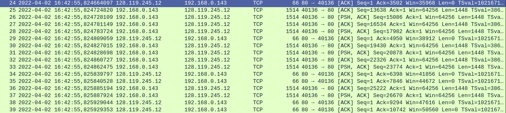

## Задачи по Wireshark

### Задание 1.
1. Source: 192.168.0.143, Source Port: 39906
2. Айпи: 128.119.245.12, порт для приема и отправки: 80

3. Sequence number: 0    (relative sequence number), Sequence number (raw): 1076680552. Определяется установкой SYN флаг.
4. Sequence number (raw): 214711786, relative 0. В поле подтверждения лежит 1076680553, это Sequence number у SYN пакета плюс один. Определяется установкой флагов SYN и ACK

5. (случайно закрыл браузер, поэтому порт поменялся)

    Sequence number: 1    (relative sequence number)
    Sequence number (raw): 3862258314
    
6. У первого пакета знаем, у следующих пяти: 3862258919(relative 606),
3862260367(relative 2054), 3862261815(relative 3502), 3862263263(relative 4950), 3862264711(relative 6398). Времена видны на скринах ниже

и

RTT меняется от 134 до 135 мс.

7. Время получения последнего ACK сегмента минус время отправки первого SYN сегмента равно 0.269102376 сек. Размер файла alice.txt равен 152138 байт. Скорость равна 152138 / 0.269102376 байт/c = 552.103135741 кбайт / c 

### Задание 2

