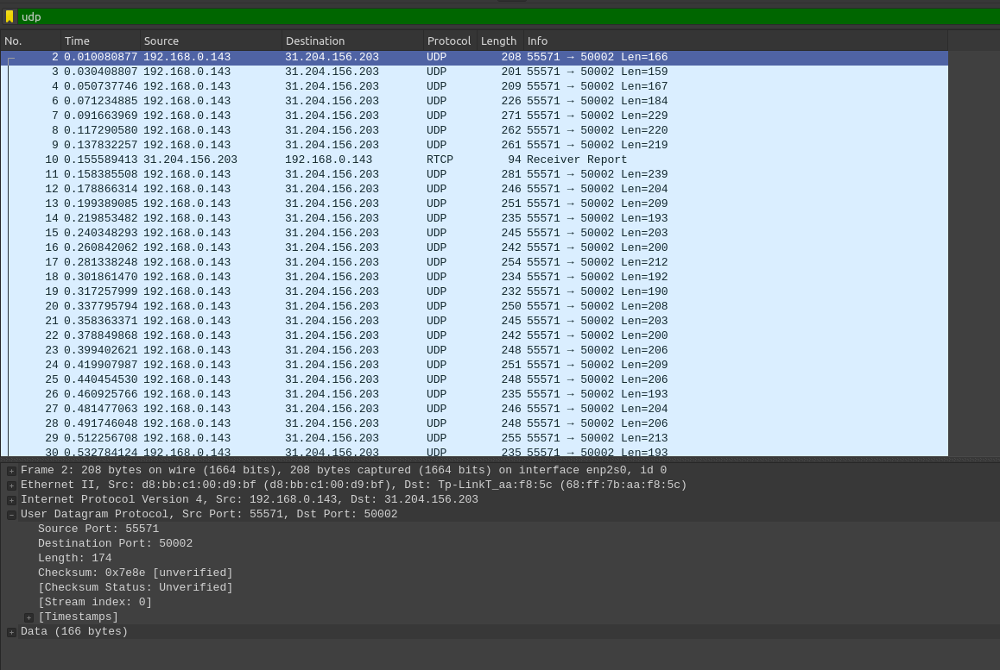

## Задачки по Wireshark

1. Четыре поля: Source Port, Destination Port, Length, Checksum
2. Каждый по два байта (два хекcовых поля)
3. Это вся длина заголовка (8 байт) плюс длина Data (166 байт) = 174 байта
4. Два байта это 2^16 - 1 и минус длина заголовка, т.е. 2^16 - 9 
5. 2^16 - 1
6. 17 dec, 11 hex

    

7. Source port первого пакета это Destination Port второго пакета, и наоборот