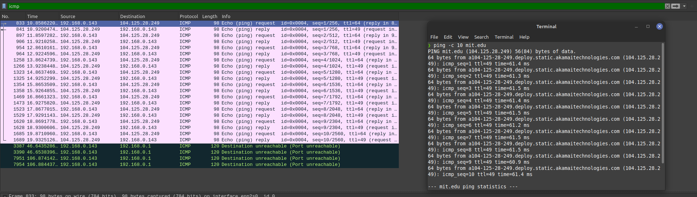
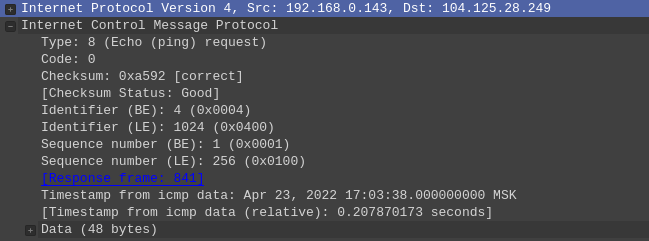
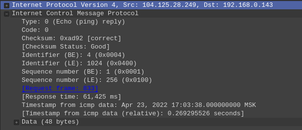
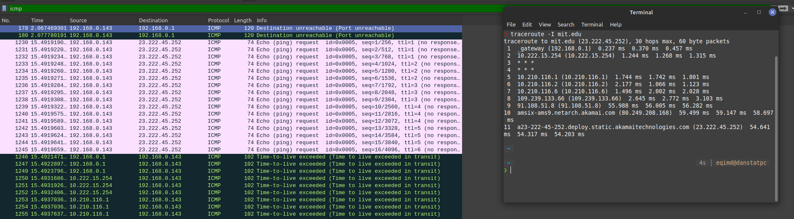
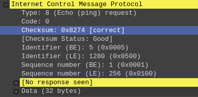
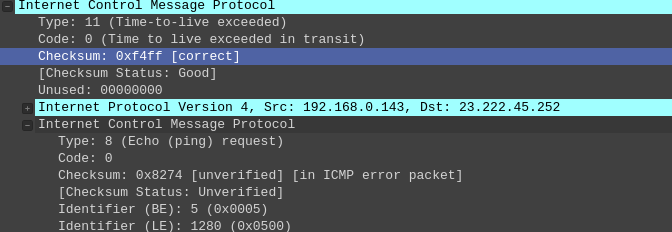
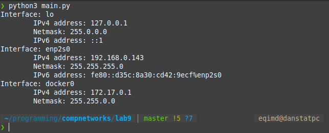
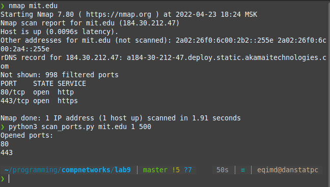

## Wireshark
### Задание 1

1. Src: 192.168.0.143, Dst: 104.125.28.249
2. Потому что это протокол сетевого уровня, а не транспортного
3. ICMP-тип 8 Echo (ping) request, кодовый номер 0, ещё поля: Checksum,
Identifier (BE), Identifier (LE), Sequence number (BE), Sequence number (LE),
Timestamp from icmp data, Data. На поля контрольной суммы, порядкового номера и 
идентификатора приходится по 2 байта на каждое поле.
    
4. Тип 0 Echo (ping) reply, код 0, поля такие же и на них приходится столько же байт
    

### Задание 2

1. Тут те же поля, чексумма и данные другие
    
2. TTL, тип запроса другой, и еще информация о IP и ICMP эхо-запроса
    
3. У них как минимум некоторые поля разные, тип разный, чексумма, длина,
нету информации об ICMP эхо-запроса 
4. Да, есть, это маршрутизаторы в Стокгольме и Франкфурте

## Скриншоты по программированию
Вывод IP

Сканер портов (сначала запускался `nmap`, чтоб показать, что порты те же)

